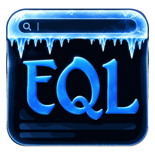
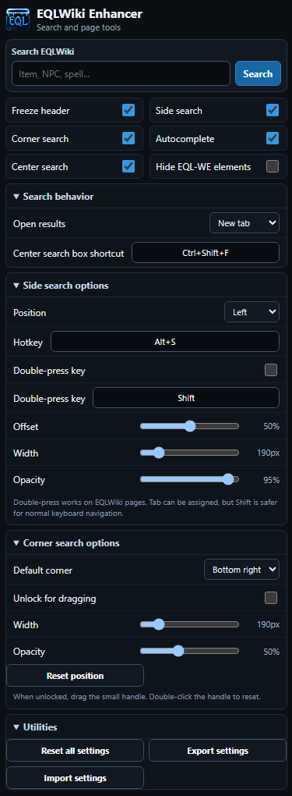
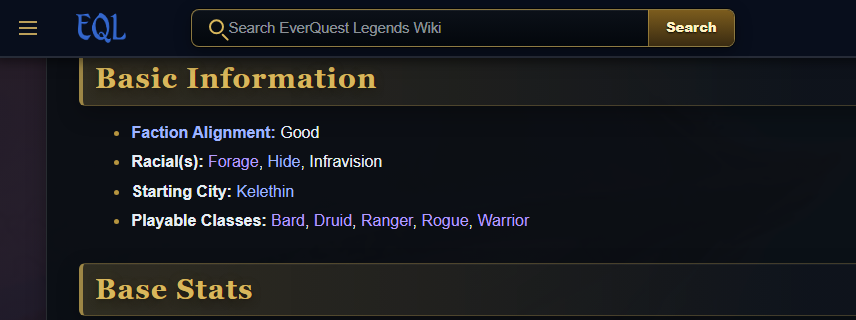
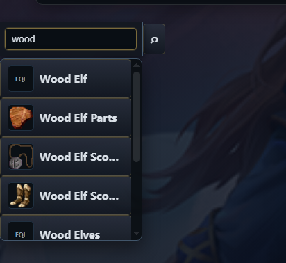
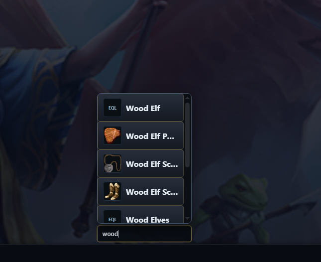
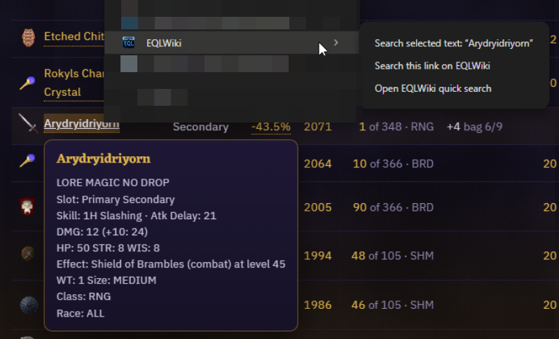

<div align="center">



# EQLWiki Search Enhancer

### EQL-WE

**A configurable Chrome extension that makes EQLWiki faster to navigate, search, and use.**

[](https://github.com/Wang-Thunder/EQLWiki-Enhancer)
[](https://developer.chrome.com/docs/extensions/develop/migrate/what-is-mv3)
[](https://developer.mozilla.org/docs/Web/JavaScript)
[](https://eqlwiki.com/)

[EQLWiki](https://eqlwiki.com/) • [Report a bug](https://github.com/Wang-Thunder/EQLWiki-Enhancer/issues) • [Support on Ko-Fi](https://ko-fi.com/wangthunder)

</div>

---

## Overview

**EQL-WE** is a lightweight quality-of-life extension built specifically for **EQLWiki**.

It began with one simple goal: keep the EQLWiki header visible while scrolling. It has since grown into a configurable set of search and navigation tools that keep the wiki close at hand whether you are browsing EQLWiki itself or searching from elsewhere in Chrome.

### At a glance

- 📌 Freeze the EQLWiki header while scrolling.
- 🔎 Search EQLWiki directly from the Chrome extension popup.
- ✨ See live autocomplete suggestions while typing.
- 🖼️ Show page thumbnails in autocomplete when a usable image is available.
- ↔️ Use a hover-expandable side search box.
- 📍 Use a draggable corner search box.
- ⌨️ Open a centered quick-search overlay with a customizable shortcut.
- 🖱️ Search selected text or links from Chrome's right-click menu.
- 🔁 Toggle the side search with a normal hotkey or optional double-press key.
- ⚙️ Customize position, size, opacity, behavior, and shortcuts.
- 💾 Export, import, and reset settings.
- 👁️ Temporarily hide EQL-WE page elements without disabling the extension.

> [!NOTE]
> EQL-WE is designed for **EQLWiki / EverQuest Legends** workflows. It does not replace the wiki. It adds convenience tools around it.

---

## Screenshots

The screenshots below show the major EQL-WE interfaces and workflows in use.

### Extension popup and settings

<p align="center">
  
</p>

### Frozen EQLWiki header

<p align="center">
  
</p>

### Side search

<p align="center">
  
</p>

### Corner search and autocomplete

<p align="center">
  
</p>

### Chrome context-menu integration

<p align="center">
  
</p>

---

## Features

### 📌 Frozen EQLWiki header

EQL-WE can detect EQLWiki's active header/navigation region and keep it fixed at the top of the browser while you scroll down long pages.

The extension inserts a layout placeholder while the header is fixed so page content does not jump upward underneath it.

**Default:** Enabled

---

### 🔎 Extension popup search

Click the EQL-WE toolbar icon to open the main control panel.

The search field is automatically focused when the popup opens, so you can immediately type an item, NPC, spell, quest, zone, or other wiki term.

Searches can open in:

- a **new tab**;
- the **current tab**.

The popup also provides quick feature toggles, expandable advanced settings, utility controls, and the project's Ko-Fi support link.

---

### ✨ Live autocomplete

When autocomplete is enabled, EQL-WE queries EQLWiki's MediaWiki search API as you type.

Autocomplete supports:

- up to **8 displayed suggestions**;
- exact-match prioritization;
- prefix-match prioritization;
- `↑` / `↓` keyboard navigation;
- `Enter` to choose a highlighted suggestion;
- `Esc` to dismiss suggestions;
- page thumbnails when a usable image is available;
- fallback EQL placeholders when no suitable page image exists.

EQLWiki pages that display the large **IMAGE NEEDED** placeholder are treated as having no usable thumbnail, so EQL-WE avoids showing that missing-image block as a result thumbnail.

---

### ↔️ Side search

A compact search control can live along the edge of EQLWiki pages and expand when the user hovers over it.

Supported positions:

- **Left**
- **Right**
- **Bottom**

#### Side-search settings

| Setting | Default |
| --- | --- |
| Enabled | Yes |
| Position | Left |
| Offset | 50% |
| Width | 190 px |
| Opacity | 95% |
| Shortcut | `Alt+S` |
| Double-press mode | Disabled |
| Double-press key | `Shift` |

#### Double-press toggle

EQL-WE can optionally open **and collapse** the side search when the configured key is pressed twice in quick succession.

The default double-press key is `Shift`, but another single key can be assigned.

> [!TIP]
> `Shift` is a safer choice than `Tab`. EQL-WE can listen for `Tab`, but overriding normal Tab behavior can interfere with keyboard navigation on webpages.

---

### 📍 Draggable corner search

A persistent search field can be placed near the lower-left or lower-right corner of the browser.

The corner search supports:

- adjustable width;
- adjustable opacity;
- left or right default placement;
- lock/unlock mode;
- free dragging while unlocked;
- saved custom coordinates;
- viewport clamping after window-size changes;
- double-clicking the drag handle to reset position.

Autocomplete is viewport-aware. If the corner search is near the bottom edge of the screen, suggestions can open **upward** instead of extending off-screen.

| Setting | Default |
| --- | --- |
| Enabled | Yes |
| Default corner | Bottom-right |
| Locked | Yes |
| Width | 190 px |
| Opacity | 50% |

---

### ⌨️ Center search overlay

EQL-WE includes a centered quick-search overlay for keyboard-first searching.

**Default shortcut:** `Ctrl+Shift+F`

The shortcut can be changed in EQL-WE's settings.

Press `Esc` to close the overlay.

> [!NOTE]
> This shortcut is handled on the page and works while an EQLWiki tab is focused.

---

### 🧩 Chrome-level popup shortcut

EQL-WE also registers a Chrome command for opening the extension popup.

| Platform | Suggested shortcut |
| --- | --- |
| Windows / Linux | `Ctrl+Shift+E` |
| macOS | `Command+Shift+E` |

Chrome extension shortcuts can be changed at:

```text
chrome://extensions/shortcuts
```

Chrome may leave a suggested shortcut unassigned if it conflicts with another extension or browser command.

---

### 🖱️ Chrome context-menu search

EQL-WE adds an **EQLWiki** submenu to Chrome's right-click menu.

Depending on what you click, the menu can provide:

- **Search selected text on EQLWiki**
- **Search this link on EQLWiki**
- **Open EQLWiki quick search**

For links, EQL-WE attempts to derive a useful wiki search term from the URL. If it cannot determine one cleanly, it opens the quick-search window instead.

This keeps the extension useful outside EQLWiki without requiring blanket access to every website just to inspect link text.

---

### 👁️ Hide EQL-WE elements

The **Hide EQL-WE elements** toggle temporarily removes EQL-WE's injected search controls from EQLWiki pages.

It hides:

- side search;
- corner search;
- center search overlay.

The frozen-header setting remains independent.

---

### ⚙️ Settings management

EQL-WE stores preferences using `chrome.storage.sync`.

The **Utilities** section includes:

- **Reset all settings**
- **Export settings** to `eql-we-settings.json`
- **Import settings** from a previously exported JSON file

Only recognized EQL-WE settings are imported.

---

## Default settings reference

| Option | Default | Description |
| --- | --- | --- |
| Freeze header | On | Keeps the EQLWiki header visible while scrolling |
| Side search | On | Enables the expandable edge search control |
| Corner search | On | Enables the persistent draggable search control |
| Autocomplete | On | Displays MediaWiki search suggestions while typing |
| Center search | On | Enables the centered keyboard search overlay |
| Hide EQL-WE elements | Off | Temporarily hides injected page search controls |
| Search result target | New tab | Chooses whether results replace the current tab |
| Center search shortcut | `Ctrl+Shift+F` | Toggles the center overlay |
| Side search shortcut | `Alt+S` | Toggles the side search |
| Side double-press | Off | Enables a single-key double-press toggle |
| Side double-press key | `Shift` | Key used when double-press mode is enabled |
| Corner lock | Locked | Controls whether the corner search can be dragged |

---

## Installation

### Load the extension manually

1. Download or clone this repository.
2. If downloaded as a ZIP, extract it to a permanent folder.
3. Open Chrome and navigate to:

   ```text
   chrome://extensions/
   ```

4. Enable **Developer mode** in the upper-right corner.
5. Click **Load unpacked**.
6. Select the folder containing `manifest.json`.
7. EQL-WE should appear in Chrome's extensions list.

### Pin EQL-WE to the toolbar

1. Click Chrome's **Extensions** puzzle-piece icon.
2. Find **EQLWiki Search Enhancer**.
3. Click the **pin** icon.

### Update an unpacked installation

After replacing the extension files with a newer version:

1. Open `chrome://extensions/`.
2. Find EQL-WE.
3. Click **Reload**.
4. Refresh any EQLWiki tabs that were already open.

---

## Usage

### Search from the extension popup

1. Click the EQL-WE toolbar icon.
2. Start typing immediately.
3. Choose an autocomplete result or press **Search**.

### Search while browsing EQLWiki

Use whichever interface best fits the situation:

- hover the side search;
- use the corner search;
- press the center-search shortcut;
- press the side-search shortcut;
- enable the optional double-press toggle.

### Search selected text from another website

1. Highlight a term in Chrome.
2. Right-click it.
3. Choose **EQLWiki → Search selected text**.

This is useful when an item, NPC, spell, quest, or zone name appears somewhere outside EQLWiki.

---

## Keyboard shortcuts

| Action | Default | Scope |
| --- | --- | --- |
| Open EQL-WE popup | `Ctrl+Shift+E` | Chrome command |
| Open center search | `Ctrl+Shift+F` | EQLWiki page |
| Toggle side search | `Alt+S` | EQLWiki page |
| Double-press side search | Disabled (`Shift` when enabled) | EQLWiki page |
| Close center search / suggestions | `Esc` | EQLWiki page |
| Move through suggestions | `↑` / `↓` | Search fields |
| Choose highlighted suggestion | `Enter` | Search fields |

---

## Permissions

EQL-WE intentionally uses a small permission set.

### `storage`

Used to save extension preferences such as enabled features, layout, opacity, shortcuts, and custom positions.

### `contextMenus`

Used to add EQLWiki search commands to Chrome's right-click menu.

### Host access

EQL-WE requests access only to:

```text
https://eqlwiki.com/*
https://www.eqlwiki.com/*
```

This allows the extension to enhance EQLWiki pages and query EQLWiki's MediaWiki API for search suggestions and page information.

---

## Privacy

EQL-WE is designed as a local browser utility.

In the current source:

- **no analytics package** is included;
- **no advertising code** is included;
- **no remote JavaScript execution** is used;
- there is **no browsing-history permission**;
- there is **no cookie permission**;
- there is **no clipboard permission**;
- there is **no location, camera, or microphone permission**;
- settings are stored in Chrome's extension storage;
- search and autocomplete requests are sent to **EQLWiki**.

Autocomplete requests are made anonymously and omit credentials.

---

## How autocomplete works

At a high level:

```text
User types
   ↓
EQL-WE background service worker
   ↓
EQLWiki MediaWiki API
   ↓
Rank + deduplicate results
   ↓
Find usable page image when available
   ↓
Autocomplete dropdown
```

EQL-WE first queries EQLWiki using MediaWiki search endpoints, ranks and deduplicates results, then attempts to attach a useful page thumbnail while filtering obvious missing-image placeholders and unrelated site graphics.

---

## Project structure

```text
.
├── manifest.json          # Chrome Manifest V3 configuration
├── background.js          # Service worker, context menus, API search, thumbnails
├── content.js             # EQLWiki page enhancements and keyboard behavior
├── styles.css             # Injected EQLWiki page UI styles
├── popup.html             # Main extension popup
├── popup.js               # Popup settings, search, import/export, autocomplete
├── popup.css              # Popup styling
├── quicksearch.html       # Context-menu quick-search window
├── quicksearch.js         # Quick-search behavior
└── icons/
    ├── icon16.png
    ├── icon48.png
    ├── icon128.png
    ├── icon_master.png
    └── support_coins.png
```

---

## Development

EQL-WE uses plain HTML, CSS, and JavaScript. There is **no compile step**.

### Requirements

For normal installation and use:

- Chrome or another Chromium browser with Manifest V3 extension support
- Internet access for EQLWiki search and autocomplete features

A text editor is **not required to install or use EQL-WE**. It is only useful if you plan to modify or contribute to the source code.

### Local workflow

1. Clone the repository.
2. Open `chrome://extensions/`.
3. Enable Developer mode.
4. Load the repository folder using **Load unpacked**.
5. Make changes.
6. Click **Reload** on the extension card.
7. Refresh the EQLWiki tab being used for testing.

### Useful syntax checks

```bash
node --check background.js
node --check content.js
node --check popup.js
node --check quicksearch.js
```

Validate `manifest.json` with:

```bash
node -e "JSON.parse(require('fs').readFileSync('manifest.json','utf8')); console.log('manifest ok')"
```

---

## Troubleshooting

<details>
<summary><strong>The frozen header is not staying visible</strong></summary>

Make sure **Freeze header** is enabled, then refresh the EQLWiki tab.

EQL-WE detects the best matching header/navigation container dynamically. If EQLWiki substantially changes its markup, the detector may need to be updated.

</details>

<details>
<summary><strong>Autocomplete is not appearing</strong></summary>

- Confirm **Autocomplete** is enabled.
- Type at least two characters.
- Confirm EQLWiki is reachable.
- Reload the extension after replacing extension files.
- Refresh EQLWiki tabs after reloading the extension.

Pages without a usable image can still appear in autocomplete. They simply use the fallback placeholder.

</details>

<details>
<summary><strong>A keyboard shortcut is not working</strong></summary>

For page-level shortcuts, make sure an EQLWiki page is focused and you are not currently typing inside another input.

For the Chrome popup shortcut, visit:

```text
chrome://extensions/shortcuts
```

Chrome may reject a suggested shortcut if another extension or browser command already uses it.

</details>

<details>
<summary><strong>The corner search moved somewhere inconvenient</strong></summary>

Open **Corner search options** and click **Reset position**.

You can also unlock the box, drag it to a new location, then lock it again.

</details>

<details>
<summary><strong>I want the injected search controls out of the way</strong></summary>

Enable **Hide EQL-WE elements**. This hides the side, corner, and center search controls without changing the frozen-header setting.

</details>

---

## Contributing

Contributions, bug reports, and feature ideas are welcome.

When reporting a bug, please include:

- Chrome/Chromium version;
- EQL-WE version;
- the EQLWiki page where the issue occurred;
- steps to reproduce it;
- a screenshot when the problem is visual;
- errors shown under `chrome://extensions/` → EQL-WE → **Errors**.

For code changes, please try to preserve the project's goals:

- keep the interface compact;
- preserve EQLWiki's existing behavior;
- avoid unnecessary permissions;
- prefer lightweight vanilla JavaScript and CSS;
- keep settings backward-compatible where practical.

---

## Support EQL-WE

Has EQL-WE been helpful? If so, please consider supporting the project on Ko-Fi.

Your donations allow me to continue developing, improving, and sharing tools just like this. **Any amount helps and is greatly appreciated.**

<div align="center">

[](https://ko-fi.com/wangthunder)

</div>

---

## Credits

EQL-WE is built around the community-maintained **[EQLWiki](https://eqlwiki.com/)** and its MediaWiki functionality.

Please support and contribute to the wiki when you can. EQL-WE is intended to make that community resource faster and easier to use, not replace it.

---

## Disclaimer

EQL-WE is an independent community utility. EverQuest and related names/assets belong to their respective owners. This project does not claim ownership of EQLWiki content or EverQuest intellectual property.

---

<div align="center">

**EQL-WE**

*Less scrolling. Faster searching. More EQ.*

</div>
